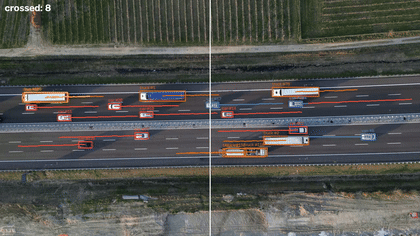
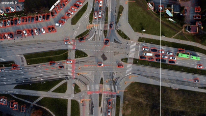
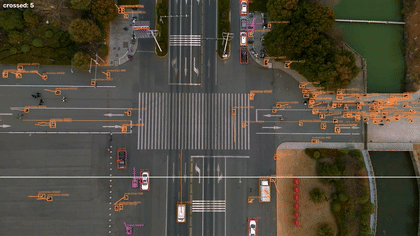

# Drone Traffic Analytics

| Static highway - directional counting | Intersection - multi-class | Zoom-out - the stress case |
|---|---|---|
|  |  |  |

*(Demos are downscaled GIFs; run the tool on any clip for full-resolution output.)*

Directional traffic counting from drone footage: **YOLO11n trained on VisDrone**
(my [previous project's](https://github.com/gallugassi3/visdrone-small-object-detection)
released weights) + multi-object tracking + an inspectable line-crossing
counter with per-class, per-direction totals - and a **measured tracker
comparison study** behind the default.

*Demo clips from [Pexels](https://www.pexels.com) (intersection footage by
Siarhei Dalivelia).*

## What it does

- Tracks every road user (car, truck, van, bus, motorcycle, pedestrian) with
  persistent ids and motion trails, at the detector's native 1024px resolution.
- Counts each track **once** when its center crosses a virtual line - horizontal
  or vertical (`--axis`), because real intersections taught me the dominant flow
  axis matters. `--tracker` selects the tracker config.
- Writes an annotated MP4, a live HUD, and a per-class/direction CSV.

```bash
python track_count.py videos/traffic.mp4 --axis v --line 0.5 --show
```

## Counts you can trust

The first counting run looked right and was **right by coincidence** - an
independent verification study (re-running the tracker, logging 14,039
trajectory points across 339 tracks, clustering crossings, and
human-reviewing crop images of every multi-track event) found two
cancelling bugs:

| Version | Total counted | vs ground truth (72 crossings, 39 left / 33 right) |
|---|---|---|
| Naive counter | 70 | +15 duplicate crossings from split trucks and id switches, -17 crossings silently dropped by an exact-on-the-line zero-product edge case |
| First dedup (80px radius) | 41 | merged real vehicles in adjacent lanes and even opposite directions - **over-correction, measured** |
| Final (direction-aware, lane-tight anisotropic dedup + edge-case fix) | **70** | **38 left / 32 right - 97% of ground truth with correct direction balance; the two residual misses are localized and analyzed in the fix report** |

Full study: [`analysis/crossing_verification.md`](analysis/crossing_verification.md) ·
fix verification: [`analysis/fix_verification.md`](analysis/fix_verification.md) ·
tooling: [`scripts/verify_crossings.py`](scripts/verify_crossings.py)

> The studies reference raw evidence (trajectory CSVs and per-crossing crops)
> generated locally by the scripts and deliberately not committed; run
> `scripts/verify_crossings.py` on your own clip to reproduce the pipeline.
> `scripts/verify_fixes.py` and `scripts/verify_display.py` hard-assert this
> study's exact data - they document the audits, they aren't general tools.

## Which tracker? A measured comparison

The pipeline shipped with ByteTrack because it is the default - so I tested
that choice: five tracker configs (ByteTrack, BoT-SORT with/without GMC,
BoT-SORT+ReID, OC-SORT) on two arenas (the static highway with its
human-verified 72 crossings, and a zoom-out stress clip), with hypotheses
pre-registered before any run.

| config | static: counted / ids / FPS | zoom-out: ids / med track |
|---|---|---|
| **bytetrack (default)** | 70 / 339 / **14.9** | 1,818 / 8 |
| botsort_gmc | 70 / 323 / 10.1 | **1,658** / **11** |
| botsort_reid | 69 / 554 / 10.4 | 2,616 / 7 |
| botsort_nogmc | 70 / 323 / 13.7 | 1,722 / 9 |
| ocsort | 70 / **302** / 12.2 | 1,904 / 9 |

Three findings worth reading:

1. **On static footage the tracker choice doesn't move the count** - every
   non-ReID config produces the identical verified table (70, 38L/32R). So
   the fastest tracker wins, and **ByteTrack stays the default - now as a
   measured choice, not an inherited one.**
2. **The headline is a refuted hypothesis:** I expected BoT-SORT's global
   motion compensation to collapse the zoom-out id churn. It bought 4-9% at
   26-28% speed cost - because the churn is mostly *detector*-driven:
   vehicles shrink toward the detection size floor and every detection
   flicker kills a track. Same conclusion as the detector project's
   resolution study, from a third direction: object size in pixels is this
   stack's first-order constraint.
3. **ReID actively hurts at this object scale:** ~35x17px low-texture
   crops give unstable embeddings, the appearance check vetoes correct
   IoU matches, fragmentation multiplies 1.6-1.7x, and it is the only
   config that breaks the counted table.

Full study with all six hypotheses and the honest verdicts:
[`analysis/tracker_study.md`](analysis/tracker_study.md) ·
raw matrix: [`analysis/tracker_study_raw.md`](analysis/tracker_study_raw.md) ·
cross-analysis: [`analysis/tracker_study_cross.md`](analysis/tracker_study_cross.md)

## Design choices

- **Weights are consumed from the detector project's Release v1.0** (not
  retrained): research repo trains and publishes; this repo builds a product
  on top.
- **Out-of-distribution by design.** The detector was trained on VisDrone
  (Chinese urban scenes, specific altitudes and cameras) and is deployed here
  on unseen European highway and intersection footage - a deliberate OOD
  setting. That it generalizes well is a finding, not a given; the failure
  modes it does show (long-truck splits, car/van twin confusion) are exactly
  what an OOD gap looks like: the model explains unfamiliar objects with the
  building blocks it knows.
- `imgsz=1024` and `conf=0.25` come straight from the detector project's
  measured findings; the default tracker comes from the study above.
- Counting is per-track-once with a sign-change test - simple enough to
  verify by eye, which is exactly what the verification study did.
- **Class display is two-layered** (measurement vs presentation): the
  *counted* class is a 15-frame majority vote at crossing time
  (ground-truth-verified); the *displayed* class adds a Schmitt trigger on
  exponentially-decayed vote mass, eliminating lookalike label flicker
  (98 -> 62 switches, zero oscillation) without accumulate-forever lock-in.
  Before/after visual proof: [`analysis/display_proof/`](analysis/display_proof/) ·
  details: `analysis/fix_verification.md` sections 8-9.

## Known limitations (measured, not guessed)

- **Split long vehicles:** the detector occasionally splits a truck into
  cab + trailer; the dedup merges those crossings (verified against human
  ground truth). Two residual misses remain in this footage, both localized
  in the fix report - one marginal 23px-vs-25px gate case, and one genuine
  nose-to-tail convoy geometrically indistinguishable from a cab/trailer
  split at the line.
- **Camera motion degrades tracking - and the bottleneck is the detector:**
  on a continuous zoom-out, 1,818 distinct track ids appear in 23.5s (an
  earlier "16K+" figure was the tracker's id *allocation* counter, ~10x the
  visible churn - corrected in the tracker study). Roughly 42-74% of track
  deaths (threshold-sensitive, reported as such) happen at the detector's
  size floor as vehicles shrink; motion compensation recovers only 4-9%.
  The counting line itself is also frame-fixed, so under camera motion it
  drifts across the real-world road - zoom-out counts are illustrative only;
  anchoring the line in world coordinates (homography) is the documented fix.
- **Class attribution inherits the detector's twin confusion** (car/van,
  truck/bus): crossing counts and directions are verified to 97%; per-class
  labels are as good as the detector's lookalike discrimination, which is
  the detector project's documented next frontier (data, not logic).
- **Throughput: 10-15 FPS measured on CPU-only torch** (ByteTrack; BoT-SORT
  variants run slower; tracking pass - drawing and encode add overhead). A
  CUDA build runs substantially faster; this is an offline analytics tool,
  not a real-time system.
- Dedup gates (25px across / 120px along / 15 frames) are calibrated for
  1280x720 @ 30fps footage; other resolutions or frame rates need rescaling.

## Setup

```bash
git clone https://github.com/gallugassi3/drone-traffic-analytics.git
cd drone-traffic-analytics
python -m venv .venv
.venv\Scripts\Activate.ps1        # Windows (use: source .venv/bin/activate on Linux)
pip install -r requirements.txt
# weights: download yolo11n_visdrone_1024.pt from the detector project's Releases
#   https://github.com/gallugassi3/visdrone-small-object-detection/releases/tag/v1.0
#   and place it in weights/
# video: any top-down drone traffic clip (Pexels has plenty) -> videos/
python track_count.py videos/your_clip.mp4 --axis v --line 0.5 --show
# try another tracker:
python track_count.py videos/your_clip.mp4 --axis v --line 0.5 --tracker trackers/ocsort.yaml
```

---

*Built by [Gal Lugassi](https://github.com/gallugassi3) - Sep 2026 - the detector
behind this: [visdrone-small-object-detection](https://github.com/gallugassi3/visdrone-small-object-detection)*