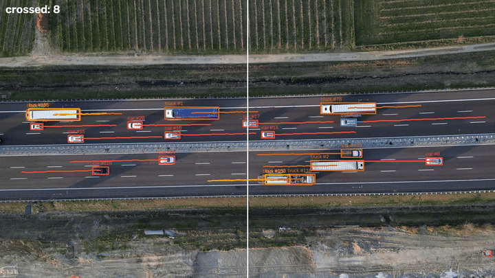

# Drone Traffic Analytics



Directional traffic counting from drone footage: **YOLO11n trained on VisDrone**
(my [previous project's](https://github.com/gallugassi3/visdrone-small-object-detection)
released weights) + **ByteTrack** multi-object tracking + an inspectable
line-crossing counter with per-class, per-direction totals.

*Demo clip by [Kelly](https://www.pexels.com/@kelly/) on Pexels; intersection clip
by Siarhei Dalivelia.*

## What it does

- Tracks every road user (car, truck, van, bus, motorcycle, pedestrian) with
  persistent ids and motion trails, at the detector's native 1024px resolution.
- Counts each track **once** when its center crosses a virtual line - horizontal
  or vertical (`--axis`), because real intersections taught me the dominant flow
  axis matters.
- Writes an annotated MP4, a live HUD, and a per-class/direction CSV.

```bash
python track_count.py videos/traffic.mp4 --axis v --line 0.5 --show
```

## Counts you can trust (the interesting part)

The first counting run looked right and was **right by coincidence** - an
independent verification study (re-running the tracker, logging all 14K
trajectories, clustering crossings, and human-reviewing crop images of every
multi-track event) found two cancelling bugs:

| Version | Total counted | Ground truth: 71 |
|---|---|---|
| Naive counter | 70 | +16 duplicate crossings from split trucks and id switches, −17 crossings silently dropped by an exact-on-the-line zero-product edge case |
| First dedup (80px radius) | 41 | merged real vehicles in adjacent lanes and even opposite directions - **over-correction, measured** |
| Final (direction-aware, lane-tight anisotropic dedup + edge-case fix) | **70** | **38 left / 32 right vs ground truth 39 / 32** |

Full study: [`analysis/crossing_verification.md`](analysis/crossing_verification.md) ·
verification tooling: [`scripts/verify_crossings.py`](scripts/verify_crossings.py)

## Design choices

- **Weights are consumed from the detector project's Release v1.0** (not retrained):
  research repo trains and publishes; this repo builds a product on top.
- `imgsz=1024` and `conf=0.25` come straight from that project's measured findings
  (the resolution experiment and the F1-optimal operating point).
- Counting is per-track-once with a sign-change test - simple enough to verify by
  eye, which is exactly what the verification study did.

## Known limitations (measured, not guessed)

- **Split long vehicles:** the detector occasionally splits a truck into
  cab + trailer; the dedup merges those crossings (verified against human ground
  truth on all 24 multi-track events).
- **Camera motion breaks tracking:** on a zoom-out clip, detection stayed solid
  but track identity churned (16K+ ids in 23s). No motion compensation - documented
  as the next step, not hidden.
- Throughput is ~11-13 FPS end-to-end on a laptop RTX 3070 (inference + tracking +
  drawing + video encode); this is an offline analytics tool, not a real-time system.

## Setup

```bash
git clone https://github.com/gallugassi3/drone-traffic-analytics.git
cd drone-traffic-analytics
python -m venv .venv
.venv\Scripts\Activate.ps1        # Windows (use: source .venv/bin/activate on Linux)
pip install -r requirements.txt
# weights: download yolo11n_visdrone_1024.pt from the detector project's Releases
#   https://github.com/gallugassi3/visdrone-small-object-detection/releases/tag/v1.0
#   and place it in weights/
# video: any top-down drone traffic clip (Pexels has plenty) -> videos/
python track_count.py videos/your_clip.mp4 --axis v --line 0.5 --show
```

---

*Built by [Gal Lugassi](https://github.com/gallugassi3) - Sep 2026 - the detector
behind this: [visdrone-small-object-detection](https://github.com/gallugassi3/visdrone-small-object-detection)*